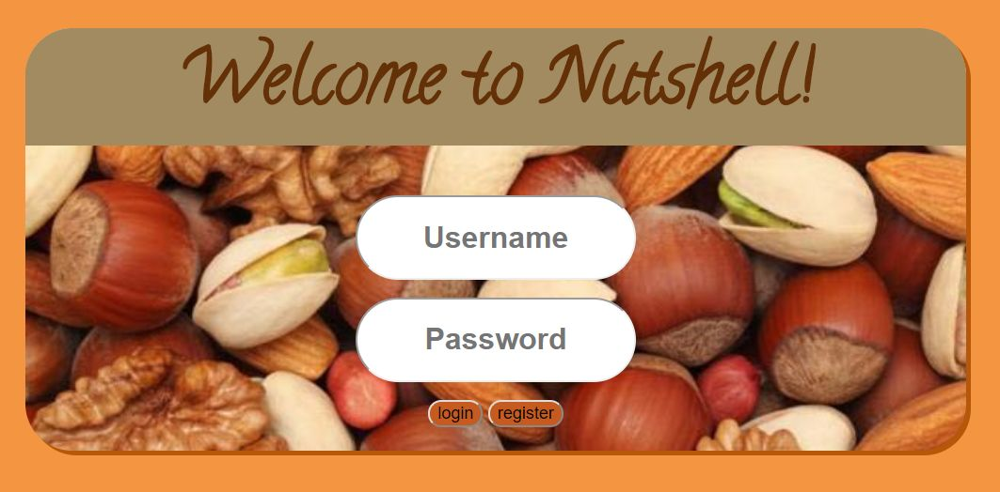
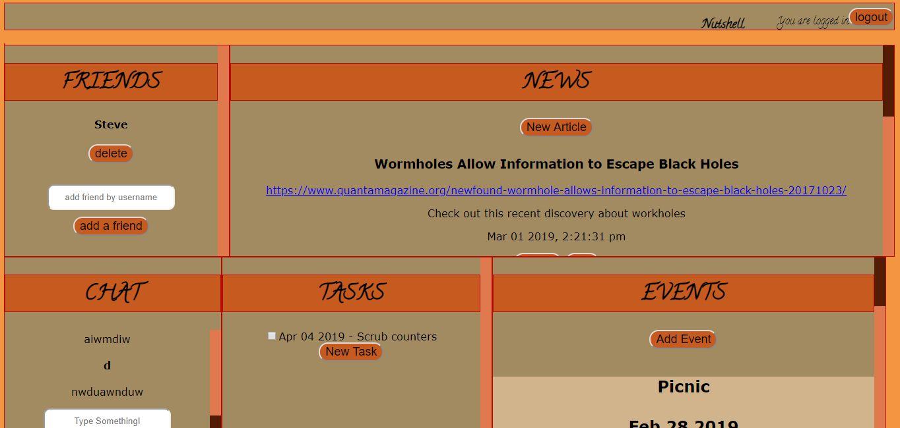
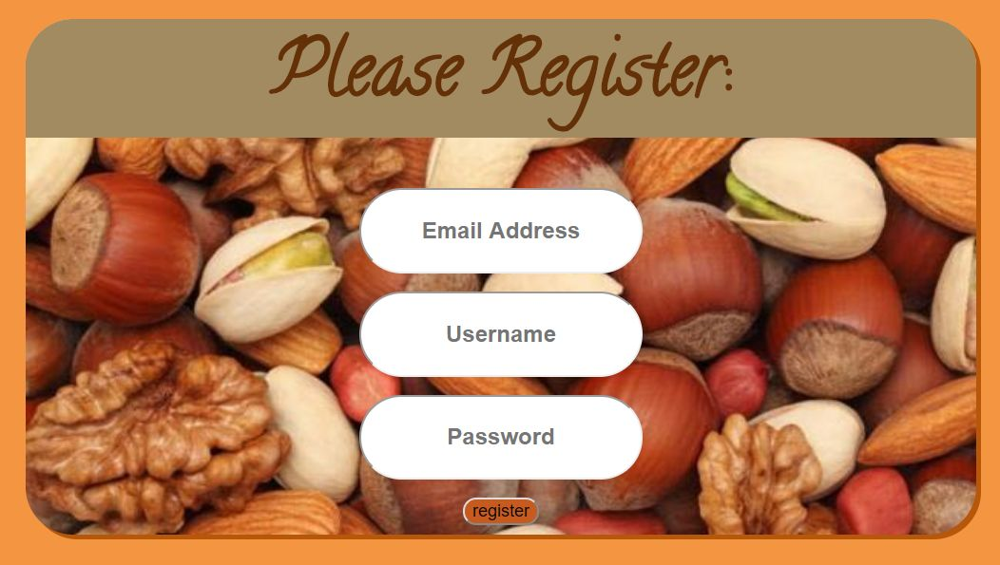
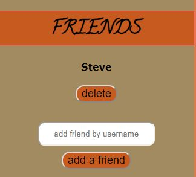
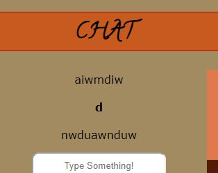
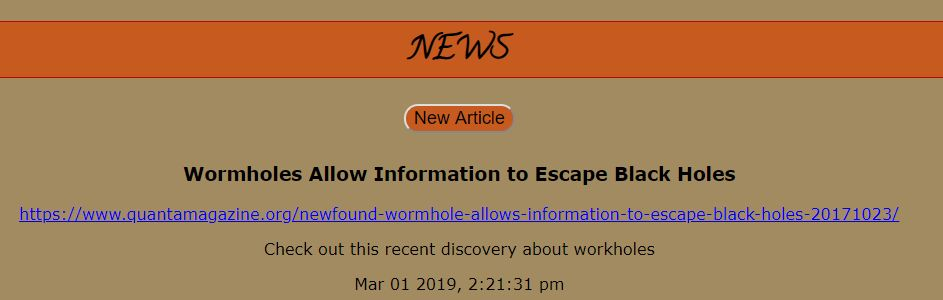
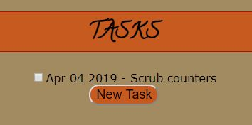
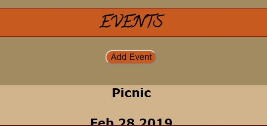
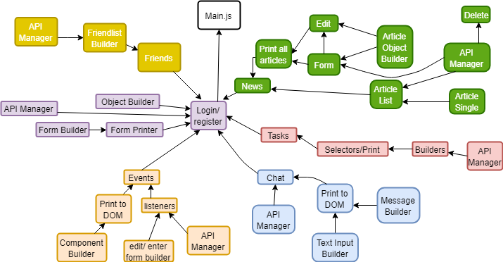
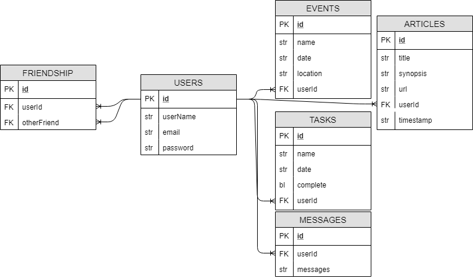

# Nutshell: The Information Dashboard
<!-- syntax for loading images -->
<!--  -->

To use this application, fork the repository and clone down to your local machine.  Navigate to the directory that you want to store the project and type the command:

```js
git clone <repository name>
```
cd into the directory and type:
```js
setUpBrowserify
```
cd into the directory src/lib and type:
```js
npm install
```
Once that has finished installing, you will also need to add an additional package called "moment.js" by typing
```js
npm install moment
```

You will need to populate the API folder with a sample db.json file using the following template:
<!-- [here](./api/boilerplatedb.txt) -->

This will create all the files needed to handle the database and browser events

Now you can type:
```js
grunt
```
The application loads with a welcome page where the user can log in, or create a new account.  To test the login feature, you can use the following credentials:
```js
Steve
password
```


## Login


Upon login, you will see the main dashboard of the Nutshell app with 5 sections.



You should now click the logout button and practice adding users.

## Register


To register a new user, click the register button and a form will appear that requests the email address, username, and password for a new user.  If the email or username already exists in the database, a window alert will pop up with an error message.  Otherwise, the new user will be created and added to the database and you will automatically be logged in.

## Friends


If you log in as Steve, you will notice that he already has one friend relationship with the user "jordan".  If you would like to add another friend, you can type a username in the box to add them by username.  You can only add friends from usernames that already exist in the app, and those you don't already have an established relationship with.

## Chat


Users can see the forum chat messages.  If they would like to add a message to the thread, they can click in the input field and type their message, then click "new message" to send.

## News


Users can add a new article to their news section by clicking the 'new article' button, edit an existing article by clicking the 'edit' button, or delete an article by clicking the 'delete' button.

## Tasks


Users can add new tasks or check off existing tasks.  When a task is checked off, it disappears from the task list.  If a user wishes to edit a task, they can click on the name of the task and an edit form will appear.  They can click 'save' or hit 'enter' to save the task.

## Events


Users can add events, or edit or delete them.  The events are ordered with the most current event up top, with a slightly different styling and background.  To edit an event, click on the 'edit event' button and to delete an event, click on the 'delete event' button.

## Logout
The user has the ability to logout at any time by clicking on the logout button at the top of the page.


## Module Map:



---

## ERD Map:

